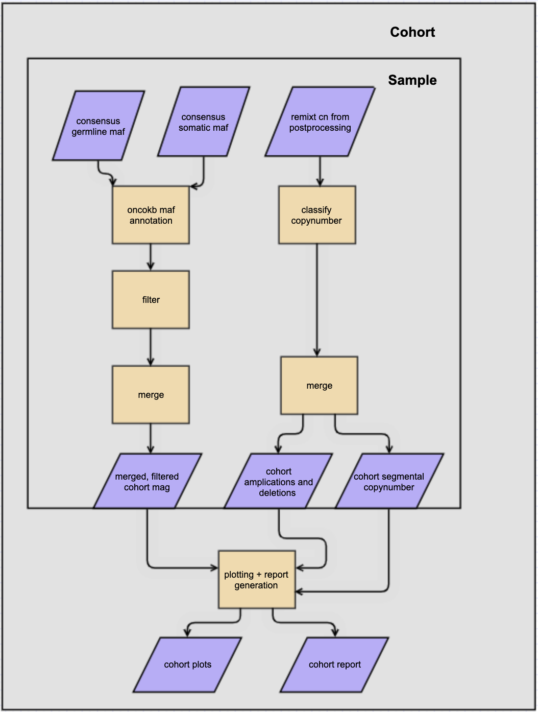

# WGS qc pipelines docs

## WGS cohort qc

### 1. Inputs
```
cohort_name:
  sample_name:
    somatic_maf: consensus somatic maf from wgs variant_calling
    germline_maf: consensus germline maf from wgs variant_calling
    remixt: remixt "cn" file from wgs remixt_postprocessinng
    group_label: {LABEL}
    ...
  sample_name:
    somatic_maf: consensus somatic maf from wgs variant_calling
    germline_maf: consensus germline maf from wgs variant_calling
    remixt: remixt "cn" file from wgs remixt_postprocessinng
    group_label: {LABEL}
  ...
```

The `group_label` field is used in the pipeline to annotate that maf `Tumor_Sample_Barcode` fields with a sample label. It can also be used to merge multiple samples by entering a common `group_label`.

### 2. Outputs
| FILE                          | DESCRIPTION                                                                                               |
|-------------------------------|-----------------------------------------------------------------------------------------------------------|
| cna_table.tsv                 |  cohort-level table of amplications and deletions from classify copynumber                                |
| cohort_oncogenic_filtered.maf | cohort-level maf annotated with oncokb and filtered on {Oncogenic, Likely Oncogenic, Predicted Oncogenic} |
| cohort_oncoplot.png           | cohort level oncoplot of  cohort_oncogenic_filtered.maf and cna_table.tsv                                 |
| mutation_burden.png           | cohort level plot of mutations/sample from  cohort_oncogenic_filtered.maf                                 |
| report.html                   | cohort level report of plots generated by pipeline                                                        |
| segmental_copynumber.tsv      | cohort-level table of copynumber segments from classify copynumber                                        |
| somatic_interactions.png      | cohort-level plot of mutually-exclusive and co-expressed genes from cohort_oncogenic_filtered.maf         |
| summary.png                   | cohort level summary plot of cohort_oncogenic_filtered.maf                                                |


### 4. Use of Cbioportal API
The pipeline uses the cBioPortal API and requires an api key to run the pipeline.
``` 
wgs cohort_qc --input_yaml {input_yaml} --API_key {key} --outdir {out} --tmppdir {tmp}
```
The API key can be obtained from [this website](https://docs.cbioportal.org/6.-web-api-and-clients/api-and-api-clients).

### 4. R scripts 

In order to run the pipeline you also need to use R scripts installable in this [conda recipe](https://github.com/shahcompbio/conda-recipes/tree/master/pseudo_bulk_qc_html_report)


## WGS sample qc
1. The format of the input yaml for wgs sample qc:
```
Patient:
  breakpoints_consensus: {filtered_consensus_calls file from wgs variant_calling 0.0.1 or 0.1.0}
  germline_calls:  {germline vcf or maf from wgs variant calling 0.0.1 or 0.1.0}
  normal_bam: {patient normal bam}
  roh: {roh from wgs variant_calling 0.0.1 or 0.1.0}
  somatic_calls:  {germline vcf or maf from wgs variant calling 0.0.1 or 0.1.0}
  titan: {titan markers from wgs copynumber 0.1.0 and 0.0.1 }
  tumour_bam: {patient tumor bam}
  remixt: {remixt h5 from wgs wgs copynumber 0.1.0 and 0.0.1}
```

2. the command format is

```
wgs cohort_qc --input_yaml {input_yaml} --outdir {out} --tmppdir {tmp}```